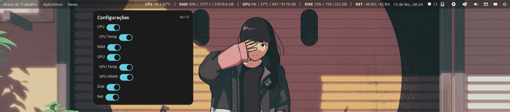

# COSMIC System Monitor Applet

<p align="center">

</p>

Clean and powerful system monitor applet for the **COSMIC Desktop Environment**.

## Fork Changes

This is a fork of [marcossl10/cosmic-system-monitor](https://github.com/marcossl10/cosmic-system-monitor) with the following changes:

- Fixed RAM display showing MB values labelled as GB
- Fixed settings popup title showing in Portuguese instead of English
- Reworked settings into per-metric sections with independent toggles
- Metrics with no toggles enabled are hidden entirely from the panel
- Fixed trailing/leading pipe separators (pipes only appear between visible metrics)
- Added left-click to launch a configurable system monitor application
- Added right-click to open the settings popup
- Added NET total transferred (session totals alongside live speed)
- GPU now has three independent toggles: percentage, temperature, VRAM

## What is COSMIC System Monitor?

A lightweight system monitoring applet that integrates seamlessly with COSMIC Desktop, showing real-time system metrics in the panel. Perfect for users who want to keep track of their system performance without cluttering their desktop.

## Usage

### Panel interaction

- **Left-click** the applet to open your system monitor application (configurable in settings)
- **Right-click** the applet to open the settings popup

### Settings

Each metric has its own section with independent toggles. A metric is only shown in the panel if at least one of its toggles is enabled.

| Metric | Toggle 1 | Toggle 2 | Toggle 3 |
|--------|----------|----------|----------|
| CPU | Percentage | Temperature | |
| RAM | Percentage | Used / Total | |
| GPU | Percentage | Temperature | VRAM |
| Disk | Percentage | Used / Total | |
| Network | Speed (live ↑↓) | Total transferred (↑↓) | |

The **Behavior** section lets you set which application to launch on left-click (e.g. `gnome-system-monitor`, `cosmic-task-manager`, `btop`).

## Supported Distributions

| Distribution | Status |
|--------------|--------|
| Pop!_OS 22.04+ | ok |
| Ubuntu 22.04+ | ok |
| Fedora 38+ | ok |
| Arch Linux | ok |

> **Note**: This applet is designed specifically for COSMIC Desktop.

## Prerequisites

### Rust Toolchain

**Debian/Ubuntu:**
```bash
sudo apt update && sudo apt install rustc cargo
```

**Fedora/CentOS/RHEL:**
```bash
sudo dnf install rust cargo
```

**Arch Linux:**
```bash
sudo pacman -S rust cargo
```

### Just (Command Runner)

**Debian/Ubuntu:**
```bash
sudo apt update && sudo apt install just
```

**Fedora/CentOS/RHEL:**
```bash
sudo dnf install just
```

**Arch Linux:**
```bash
sudo pacman -S just
```

### System Development Libraries

**Debian/Ubuntu:**
```bash
sudo apt update && sudo apt install build-essential libsensors-dev libgtk-3-dev libdbus-1-dev pkg-config
```

**Fedora/CentOS/RHEL:**
```bash
sudo dnf groupinstall "Development Tools"
sudo dnf install lm_sensors-devel gtk3-devel dbus-devel pkg-config
```

**Arch Linux:**
```bash
sudo pacman -S base-devel lm_sensors gtk3 dbus pkgconf
```

### COSMIC Dependencies

**Pop!_OS:**
```bash
sudo apt update && sudo apt install libcosmic-dev
```

**Other Distributions:**
You may need to build `libcosmic` from source. Check the [libcosmic repository](https://github.com/pop-os/libcosmic) for more information.

## Installation

### Step 1: Clone the Repository

```bash
git clone https://github.com/Esp-L/cosmic-system-monitor.git
cd cosmic-system-monitor
```

### Step 2: Build

```bash
cargo build --release
```

### Step 3: Install the binary

```bash
sudo cp target/release/cosmic-sys-monitor /usr/local/bin/
```

### Step 4: Restart COSMIC Panel

```bash
killall cosmic-panel
```

The session manager will relaunch the panel automatically. The applet should now appear in your panel configuration.

## Adding to Panel

1. Open **Settings**
2. Navigate to **Desktop** → **Panel**
3. Click the **+** button to add an applet
4. Select **System Monitor**

## Troubleshooting

### Applet Not Appearing

1. Verify installation: `ls -la /usr/local/bin/cosmic-sys-monitor`
2. Try running manually: `cosmic-sys-monitor`

### Build Fails

1. Ensure all dependencies are installed
2. Update Rust: `rustup update`
3. Clean build: `cargo clean && cargo build --release`

### Sensors Not Detected

```bash
sudo sensors-detect
sudo systemctl enable --now lm_sensors
```

## Uninstallation

```bash
sudo rm /usr/local/bin/cosmic-sys-monitor
```

## License

This project is licensed under the MIT License - see the [LICENSE](LICENSE) file for details.

## Acknowledgments

- [marcossl10/cosmic-system-monitor](https://github.com/marcossl10/cosmic-system-monitor) - Original project
- [pop-os/libcosmic](https://github.com/pop-os/libcosmic) - COSMIC Desktop library
- [sysinfo](https://github.com/GuillaumeGomez/sysinfo) - System information library
